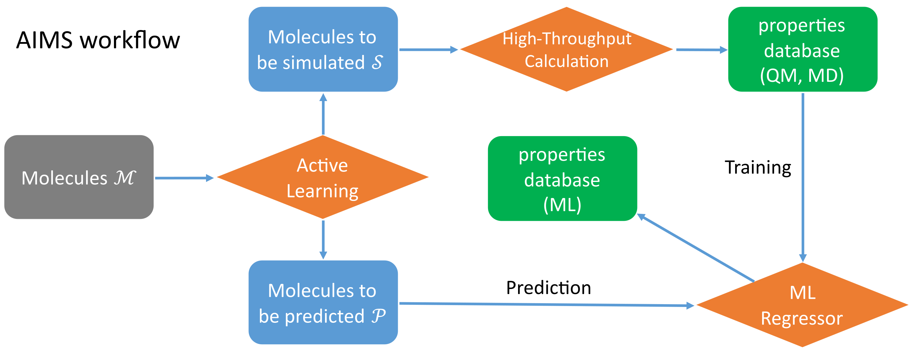
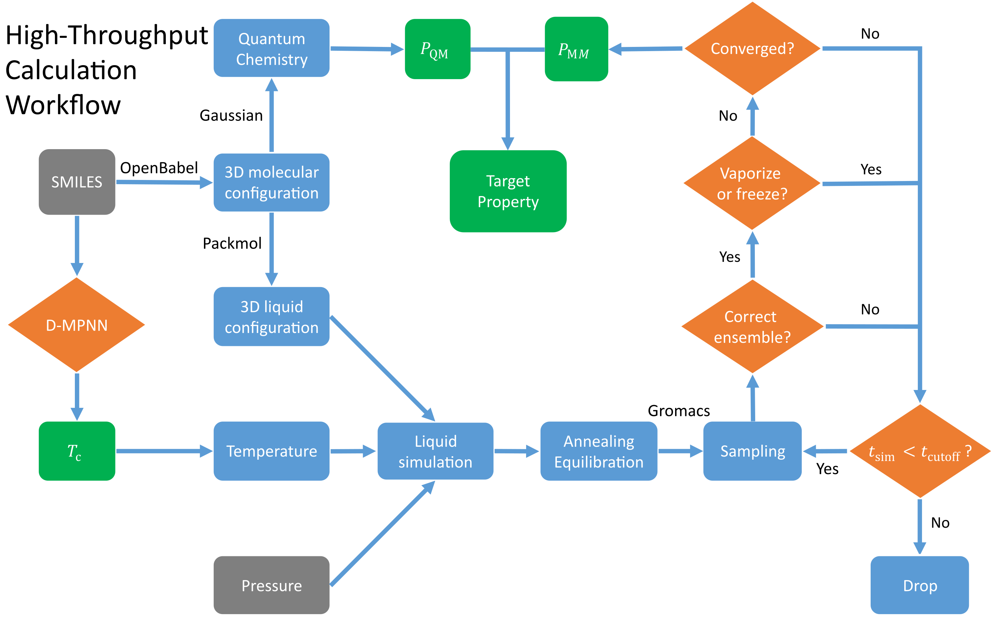

# ALMS (Active Learning Molecular Simulation)
ALMS is a program designed to generate large-scale molecular property data sets using machine learning and computational chemistry techniques. [Efficient Exploration of Chemical Compound Space Using Active Learning for Prediction of Thermodynamic Properties of Alkane Molecules](https://pubs.acs.org/doi/full/10.1021/acs.jcim.3c01430).

It contains three main parts.
- Active Learning ([Gaussian Process Regression, Marginalized Graph Kernel](https://github.com/xiangyan93/Chem-Graph-Kernel-Machine)).
- High-throughput Quamtum Chemistry Calculation (GAUSSIAN) and classical Force-Field Molecular Dynamics Simulation (GROMACS).
- Machine Learning Prediction ([Direct Message Passing Neural Network](https://github.com/chemprop/chemprop)).

The workflow of ALMS:
<div align="center">
<p></p>
</div> 

The workflow of high-throughput calculation engine:
<div align="center">
<p></p>
</div> 

## Dependencies and Installation
- [GAUSSIAN](https://gaussian.com/gaussian16/) (Quantum Chemistry).
- [DFF](http://www.acc-sh.com/), 
[Packmol](http://leandro.iqm.unicamp.br/m3g/packmol/home.shtml), 
[GROMACS](https://manual.gromacs.org/documentation/) (Molecular Dynamics).
- Require GCC (7.*), NVIDIA Driver and CUDA toolkit(>=10.1) ([GraphDot](https://gitlab.com/yhtang/GraphDot)).
 
```
conda env create -f environment.yml
conda activate alms
```
- "monitor.py" need to run on a cluster with SLURM job manager to automatically submit jobs and
collect results.

## Usages
1. Submit molecules to the database.
   - Type SMILES of molecules.
   ```
   python3 submit.py --smiles CCCC CCCCC CCCCCC --files data/test.csv --features_generator rdkit_2d_normalized --heavy_atoms 4 19
   ```
2. Calculate the kernel matrix and save in data/kernel.pkl. Must run in GPU.
   ```
   python3 calc_kernel.py --n_jobs 6
   ```
3. High-throughput QM calculation.
   ```
   python3 monitor.py --task qm_cv --partition cpu --n_cores 8 --n_jobs 8  --gaussian_exe $GAUSSIAN --n_conformer 1 --stop_uncertainty 0.3 --graph_kernel_type preCalc
   ```
4. High-throughput MD simulation.
   ```
   python3 monitor.py --task md_npt --partition gtx --n_cores 16 --n_hypercores 32 --n_gpu 2 --n_jobs 8 --packmol_exe $PACKMOL --dff_root $DFF --gmx_exe_analysis gmx_serial --gmx_exe_mdrun gmx_gpu --stop_uncertainty 0.3 --graph_kernel_type preCalc
   ```
5. Export simulation data.
   ```
   python3 export.py --property cp
   ```
6. Train and predict using D-MPNN.
   It is suggested to learn how to use D-MPNN at https://github.com/chemprop/chemprop. 
   Add temperature as model input by adding ```--features_columns T```.
   ```
   python3 train.py --data_path cp.csv --dataset_type regression --save_dir ml-models/cp-dmpnn --split_type random --split_sizes 1.0 0.0 0.0 --metric mae --num_fold 1 --ensemble_size 1 --epochs 100 --save_preds --smiles_columns smiles --features_columns T --target_columns cp --features_generator rdkit_2d --num_workers 6 --aggregation sum
   python3 predict.py --data_path cp_test_set.csv --preds_path cp_preds.csv --checkpoint_dir ml-models/cp-dmpnn --features_generator rdkit_2d --features_columns T
   ```
